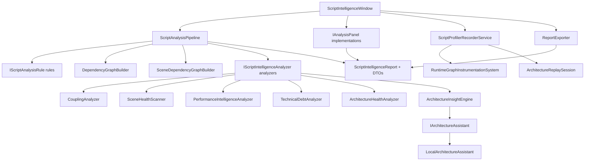
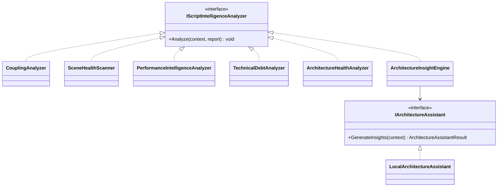
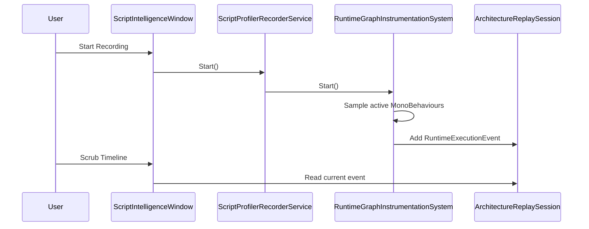

# Script Intelligence Studio Architecture

## Module Dependency Map

## Analyzer Class Diagram

## Runtime Replay Flow

## Extension Points

- Add static rules by implementing `IScriptAnalysisRule`.
- Add report enrichment by implementing `IScriptIntelligenceAnalyzer`.
- Add AI providers by implementing `IArchitectureAssistant`.
- Add visual surfaces by implementing `IAnalysisPanel`.
