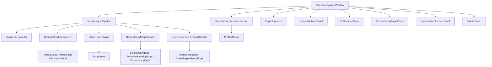

# Script Intelligence Technical Documentation

## 1. Purpose

Script Intelligence is a Unity Editor tooling package for inspecting script architecture, performance risks, scene wiring, and runtime script activity from inside the Unity Editor.

The goal is to give a Unity developer a single professional tool window that answers practical questions:

- Which scripts have `Update`, `FixedUpdate`, or `LateUpdate` callbacks?
- Which scripts are likely creating garbage or doing expensive work in hot paths?
- How are scene scripts connected to each other?
- Which scripts are over-coupled, isolated, or part of circular dependencies?
- What runtime script activity is visible while the project is in Play Mode?
- Can the findings be exported for review or portfolio presentation?

This is implemented as an Editor-only system under `Assets/ScriptIntelligence/Editor`, so it does not ship in player builds.

## 2. User Workflow

1. Open Unity.
2. Open the tool from `Tools > Script Intelligence > Open`.
3. Press `Scan Project`.
4. Review the summary cards at the top of the window.
5. Move between feature tabs:
   - Update Analyzer
   - GC Heatmap
   - Dependency Graph
   - Optimization Scanner
   - Runtime Profiler
6. In the Dependency Graph, inspect the script galaxy, zoom in/out, click nodes, and click relationship labels to see exact relationship evidence.
7. Export JSON or Markdown reports when needed.

For scene dependency results, scripts must be present in the active scene and serialized references must be assigned in the Inspector.

## 3. Architecture Overview

The tool is split into independent modules instead of one large script. The main window coordinates scanning, state, tabs, and exports. Each feature owns its own panel renderer and data model.



### Main Design Principle

The EditorWindow does not perform feature logic directly. It delegates:

- source discovery to `SourceFileProvider`
- script parsing to `CSharpStructureScanner`
- issue detection to `IScriptAnalysisRule` implementations
- architecture relationship extraction to `DependencyGraphBuilder`
- active scene reference extraction to `SceneDependencyGraphBuilder`
- UI rendering to individual panel classes
- report writing to `ReportExporter`
- runtime sampling to `ScriptProfilerRecorderService`

This makes each feature replaceable and testable in isolation.

## 4. Folder Structure

```text
Assets/
  ScriptIntelligence/
    Editor/
      ScriptIntelligenceWindow.cs
      README.md
      ROADMAP.md
      TECHNICAL_DOCUMENTATION.md
      Analysis/
      Analysis/Rules/
      DependencyGraph/
      Models/
      Profiling/
      Reporting/
      UI/
      Utilities/
  Dummy/
```

### Key Folders

`Analysis`

Handles project source discovery, lightweight C# parsing, and scan orchestration.

`Analysis/Rules`

Contains independent optimization and quality rules. Each rule implements `IScriptAnalysisRule`.

`DependencyGraph`

Builds static script relationships and active scene dependency relationships.

`Models`

Contains serializable result types shared between analysis, UI, reports, and profiling.

`Profiling`

Owns runtime `ProfilerRecorder` setup and sampling.

`Reporting`

Exports scan results to JSON and Markdown.

`UI`

Contains one renderer class per tool tab.

`Utilities`

Contains small Editor helper utilities such as source-file navigation.

`Dummy`

Contains production-style test MonoBehaviours that can be attached in a scene and wired together to validate the graph.

## 5. Main Editor Window

File:

```text
Assets/ScriptIntelligence/Editor/ScriptIntelligenceWindow.cs
```

Responsibilities:

- registers the menu item
- owns the active report state
- creates and stores panel instances
- renders toolbar actions
- renders scan summary metrics
- routes the selected tab to the correct panel
- starts scans through `ScriptAnalysisPipeline`
- triggers report export through `ReportExporter`
- updates profiler sampling while the window is open

The top summary cards currently expose high-level counts such as:

- scene script count
- update callback count
- issue count
- scene reference count
- cycle count

The window uses lazy initialization so that styles, panels, and services are created only when needed.

## 6. Source Discovery and Parsing

### Source Discovery

File:

```text
Assets/ScriptIntelligence/Editor/Analysis/SourceFileProvider.cs
```

The provider scans project source files under `Assets`.

Current behavior:

- includes `.cs` files
- excludes scripts inside Editor folders for gameplay/scene analysis
- returns each file as a `SourceFile`

This avoids analyzing the Script Intelligence tool's own Editor scripts as gameplay scripts in most feature views.

### Structure Scanner

File:

```text
Assets/ScriptIntelligence/Editor/Analysis/CSharpStructureScanner.cs
```

The scanner extracts a lightweight model of C# scripts:

- class names
- base types
- whether the class is a `MonoBehaviour`
- fields
- field type
- field visibility
- serialized/private fields
- methods
- method names
- method line numbers
- method body text

The parsed output is represented by:

- `ParsedClass`
- `ParsedField`
- `ParsedMethod`

### Current Parser Tradeoff

The parser is intentionally dependency-free. It does not require Roslyn packages to be installed in the Unity project.

That makes the tool easy to drop into a new project, but it also means the current parser is heuristic. It can detect many practical Unity script patterns, but it is not a full compiler-semantic analyzer.

Planned upgrade:

- replace or supplement `CSharpStructureScanner` with Roslyn semantic analysis
- detect exact symbols instead of matching text patterns
- support exact method-call graphs, boxing detection, allocation chains, generics, partial classes, and namespace-aware type resolution

## 7. Static Analysis Pipeline

File:

```text
Assets/ScriptIntelligence/Editor/Analysis/ScriptAnalysisPipeline.cs
```

The pipeline coordinates a full scan:

1. Find source files.
2. Parse source files into script structure models.
3. Run all registered rules.
4. Build static dependency graph data.
5. Build active scene dependency data.
6. Collect update method information.
7. Return one `ScriptIntelligenceReport`.

The report object becomes the single source of truth for the UI and export system.

## 8. Static Rule Engine

Interface:

```text
Assets/ScriptIntelligence/Editor/Analysis/Rules/IScriptAnalysisRule.cs
```

Every rule is isolated behind the same contract. This keeps the scanner extensible and prevents feature logic from being mixed into UI code.

Each rule returns `ScriptIssue` entries with:

- rule id
- severity
- title
- description
- asset path
- line number
- script name
- method name

### Current Rules

`AllocationInUpdateRule`

Detects allocations in hot paths such as `Update`, `FixedUpdate`, and `LateUpdate`.

`LinqInUpdateRule`

Detects LINQ usage in hot paths. LINQ can allocate and hide iteration cost.

`GetComponentInHotPathRule`

Detects `GetComponent` calls inside hot paths or loops.

`FindObjectInHotPathRule`

Detects scene-wide lookups such as `FindObjectOfType` or `GameObject.Find` in hot paths.

`StringConcatInUpdateRule`

Detects string concatenation and string construction patterns inside hot paths.

`DebugLogInHotPathRule`

Detects logging in update-family methods.

`EmptyUpdateRule`

Detects empty update callbacks that still pay Unity callback overhead.

`LongMethodRule`

Detects large methods that should be reviewed for maintainability, complexity, or hidden performance work.

## 9. Update Analyzer

Panel:

```text
Assets/ScriptIntelligence/Editor/UI/UpdateAnalyzerPanel.cs
```

Purpose:

- list scripts containing `Update`, `FixedUpdate`, and `LateUpdate`
- show where those methods live
- make hot-path scripts easy to inspect

Why it matters:

Unity calls these methods frequently. A large number of update callbacks, or expensive logic inside them, can become a performance problem. The panel helps identify scripts that deserve closer review.

## 10. GC Heatmap

Panel:

```text
Assets/ScriptIntelligence/Editor/UI/GcHeatmapPanel.cs
```

Purpose:

- surface allocation-heavy code patterns
- prioritize findings by severity
- help developers quickly locate code that may create frame-time spikes

Examples of flagged patterns:

- `new` allocations in update methods
- LINQ chains in hot paths
- string concatenation per frame
- repeated collection creation

This panel is especially useful before profiling sessions, because it identifies likely allocation sources before runtime testing.

## 11. Optimization Scanner

Panel:

```text
Assets/ScriptIntelligence/Editor/UI/OptimizationScannerPanel.cs
```

Purpose:

- show all detected issues in one review list
- group findings by severity and rule
- provide source navigation for actionable code review

This is the general-purpose code quality and performance checklist panel.

Current issue categories include:

- garbage allocation risks
- hot-path performance risks
- maintainability risks
- unnecessary Unity callbacks

## 12. Dependency Graph: Living Software Galaxy

Panel:

```text
Assets/ScriptIntelligence/Editor/UI/DependencyGraphPanel.cs
```

Static graph builder:

```text
Assets/ScriptIntelligence/Editor/DependencyGraph/DependencyGraphBuilder.cs
```

Scene graph builder:

```text
Assets/ScriptIntelligence/Editor/DependencyGraph/SceneDependencyGraphBuilder.cs
```

The Dependency Graph is designed as a light-themed, Obsidian-style software galaxy.

Each node represents a script. The graph shows how scripts are connected through code relationships and scene references.

### Node Meaning

Each script node exposes:

- script name
- method count
- field count
- reference count
- rough complexity score
- health status

Node size is based on rough complexity. More methods, fields, relationships, and issues produce a larger node.

Node color communicates health:

- blue: normal script
- red: over-coupled or issue-heavy script
- gray: isolated or dead-looking script
- stronger blue: selected script

### Relationship Types

The graph supports multiple relationship categories:

`SerializedField`

A script has a field reference to another project script.

Example:

```csharp
[SerializeField] private PlayerRuntimeCoordinator playerRuntime;
```

Visual color: blue.

`MethodCall`

A script method calls through a referenced field.

Example:

```csharp
playerRuntime.ConfigureRuntime(profile);
```

Visual color: green.

`EventSubscription`

A script subscribes or unsubscribes to an event on another script.

Example:

```csharp
playerRuntime.OnHealthChanged += HandleHealthChanged;
```

Visual color: orange.

`SingletonUsage`

A script accesses another type through an `Instance` pattern.

Example:

```csharp
TelemetryEventGateway.Instance.RecordMissionStarted();
```

Visual color: purple.

`Inheritance`

A script inherits from a project type.

Example:

```csharp
public class PlayerRuntimeCoordinator : RuntimeCoordinatorBase
```

Visual color: gold.

`InterfaceImplementation`

A script implements an interface.

Example:

```csharp
public class EncounterWaveDirector : IMissionSystem
```

Visual color: cyan.

### Edge Labels

Edges are not anonymous lines. Relationship labels explain what links two scripts.

Example labels:

- `field: playerRuntime -> PlayerRuntimeCoordinator`
- `call: ConfigureRuntime -> PlayerRuntimeCoordinator`
- `event: OnHealthChanged -> MissionHudPresenter`
- `singleton: TelemetryEventGateway.Instance`
- `inherits: RuntimeCoordinatorBase`
- `implements: IMissionSystem`

This solves the most important usability problem in graph tools: the user can see not only that two scripts are connected, but also why they are connected.

### Relationship Inspector

Clicking a relationship label opens details in the side panel:

- relationship type
- source script
- target script
- source member or field
- method where it was detected
- line number
- evidence text
- source navigation button

This makes the graph actionable instead of decorative.

### Zoom and View Controls

The graph includes:

- zoom out button
- zoom slider
- zoom percentage display
- zoom in button
- fit-to-view button
- mouse wheel zoom over the graph canvas

This allows small and medium projects to be inspected comfortably inside the Editor window.

### Scene Dependency Layer

The scene dependency scanner reads the active scene and finds real serialized object references between attached `MonoBehaviour` instances.

This is separate from static code relationships.

Static graph answers:

```text
Can this script reference this other script by code?
```

Scene graph answers:

```text
Is this specific scene object wired to this other scene object right now?
```

The scene graph uses Unity serialization, so private serialized fields are included when they are assigned.

## 13. Circular Dependency Detection

Model:

```text
Assets/ScriptIntelligence/Editor/Models/DependencyCycle.cs
```

The static graph builder performs dependency cycle detection using graph traversal.

Example:

```text
LiveOpsMissionOrchestrator -> PlayerRuntimeCoordinator -> EncounterWaveDirector -> LiveOpsMissionOrchestrator
```

Why this matters:

- circular script dependencies make refactors harder
- they often indicate unclear ownership boundaries
- they can cause initialization order problems
- they make unit testing and scene reuse more difficult

The tool reports cycles so they can be reviewed before they become architectural debt.

## 14. Runtime Profiler

Service:

```text
Assets/ScriptIntelligence/Editor/Profiling/ScriptProfilerRecorderService.cs
```

Panel:

```text
Assets/ScriptIntelligence/Editor/UI/ProfilerPanel.cs
```

The runtime profiler uses Unity's `ProfilerRecorder` API to sample script-related profiler data while the Editor is in Play Mode.

Current metric:

- `ProfilerCategory.Scripts`
- `BehaviourUpdate`

The service tracks:

- latest sample
- rolling average
- sample history
- whether recording is active

Current limitation:

The profiler is not yet mapped to exact script methods. It shows script-system activity at the Unity profiler marker level. The future version should correlate profiler samples with static hot-path analysis and, where possible, Unity profiler markers or custom instrumentation.

## 15. Report Export

File:

```text
Assets/ScriptIntelligence/Editor/Reporting/ReportExporter.cs
```

The tool can export scan results as:

- JSON
- Markdown

JSON is useful for:

- automation
- future CI integration
- custom dashboards
- historical comparison

Markdown is useful for:

- code review notes
- portfolio documentation
- sharing findings with teammates
- lightweight architecture reports

The exported report includes:

- generated timestamp
- scene script count
- scene reference count
- architecture relationship count
- update callback count
- issue count
- cycles
- top issues
- relationships
- scene references

## 16. Dummy Enterprise Scripts

Folder:

```text
Assets/Dummy
```

The dummy scripts are intentionally named and structured like a larger production project instead of simple test scripts.

Current scripts:

- `LiveOpsMissionOrchestrator`
- `PlayerRuntimeCoordinator`
- `EncounterWaveDirector`
- `MissionHudPresenter`
- `TelemetryEventGateway`

These scripts are designed to demonstrate:

- serialized references
- private fields
- event subscriptions
- method calls between systems
- singleton-style access
- long business-logic-style methods
- update methods
- optimization warnings
- dependency graph relationships

Recommended setup:

1. Create five GameObjects in a scene.
2. Attach one dummy script to each GameObject.
3. Assign serialized references between the scripts in the Inspector.
4. Open Script Intelligence.
5. Press `Scan Project`.
6. Inspect the Dependency Graph and scene references.

## 17. Data Model Summary

Important shared models:

`ScriptIntelligenceReport`

The root report object returned after a scan.

`ScriptIssue`

A static analysis finding.

`UpdateMethodInfo`

Information about one update-family method.

`ScriptGraphNode`

A script-level architecture graph node.

`ScriptFieldNode`

Field metadata for a script node.

`ScriptMethodNode`

Method metadata for a script node.

`ScriptRelationshipEdge`

A typed relationship between scripts.

`DependencyEdge`

A lower-level field dependency edge.

`DependencyCycle`

A detected script dependency cycle.

`SceneScriptNode`

A concrete script component instance in the active scene.

`SceneDependencyEdge`

A concrete serialized reference between two scene script instances.

`ProfilerMetric`

A runtime profiler sample summary.

## 18. Current Limitations

The current implementation is useful, but it is not yet a full compiler-grade architecture analyzer.

Known limitations:

- parsing is heuristic and dependency-free, not Roslyn semantic analysis
- method-call relationships are inferred from field names and method bodies
- exact overload resolution is not available yet
- partial classes and advanced generic patterns may be incomplete
- runtime profiler data is not yet per-script
- graph layout is editor-rendered and not GPU/compute-shader based
- scene references require assigned Inspector references
- runtime edge flashing is planned but not implemented yet

These limitations are acceptable for the current stage because the architecture isolates the scanner, graph builder, profiler, and UI. Each can be upgraded without rewriting the whole tool.

## 19. Recommended Future Additions

### Roslyn Semantic Backend

Add Roslyn packages and replace heuristic parsing with compiler symbols.

Benefits:

- exact method calls
- exact field references
- namespace-aware type resolution
- boxing detection
- allocation flow analysis
- call stack depth analysis
- partial class support
- interface and inheritance accuracy

### Runtime Execution Flow

Add optional instrumentation or custom profiler markers so the graph can flash active edges in Play Mode.

Target behavior:

- method-call edges glow when executed
- hot edges become thicker
- recent execution trails fade over time
- profiler spikes highlight likely source scripts

### Scene Wiring Health

Add dedicated scene validation rules:

- unassigned serialized fields
- duplicate manager objects
- references crossing scene boundaries
- inactive object references
- missing required components
- circular scene object references

### Rule Configuration

Add project-level settings:

- enable or disable rules
- severity overrides
- long method threshold
- max allowed update callbacks
- over-coupling threshold
- ignored folders
- suppression comments

### Fix Suggestions

Add controlled quick fixes:

- remove empty `Update`
- cache `GetComponent` in `Awake`
- move allocation from `Update` to initialization
- replace string concatenation with cached buffers where appropriate

All fixes should use preview diffs before writing files.

### Graph Filtering

Add filters for:

- scene
- namespace
- assembly
- selected GameObject
- relationship type
- issue severity
- isolated scripts
- over-coupled scripts
- cyclic scripts

### CI Mode

Add a batchmode report command for automated checks.

Example future use:

```text
Unity.exe -batchmode -projectPath <project> -executeMethod ScriptIntelligence.Ci.ExportReport
```

Potential gates:

- fail if critical issues exist
- fail if cycles increase
- fail if update callbacks exceed a threshold
- fail if new unassigned scene references appear

## 20. Portfolio Positioning

This project demonstrates several senior Unity engineering skills:

- Unity EditorWindow tooling
- modular editor architecture
- static code analysis design
- rule-engine design
- graph data modeling
- dependency cycle detection
- scene serialization inspection
- profiler API usage
- custom IMGUI-based professional UI
- report generation
- production-style dummy scenario design

The strongest positioning is:

```text
AI-ready Script Intelligence and Architecture Visualization System for Unity
```

The tool is not only a visual graph. It is a practical architecture and optimization assistant that combines static analysis, scene inspection, runtime profiler sampling, and actionable report export.

## 21. Validation Checklist

Use this checklist when verifying the tool after changes:

- Unity compiles without Editor errors.
- `Tools > Script Intelligence > Open` opens the window.
- `Scan Project` completes.
- Summary cards show reasonable counts.
- Update Analyzer lists update-family methods.
- GC Heatmap shows allocation-related issues from dummy scripts.
- Optimization Scanner shows rule findings.
- Dependency Graph shows script nodes, colored edges, and readable relationship labels.
- Graph zoom buttons, slider, mouse wheel, and fit button work.
- Clicking a script updates the script inspector.
- Clicking an edge label updates the relationship inspector.
- Open source buttons navigate to the correct file and line.
- Scene dependency results appear after dummy scripts are attached and assigned in the scene.
- Runtime Profiler records while in Play Mode.
- JSON export writes a readable report.
- Markdown export writes a readable report.

